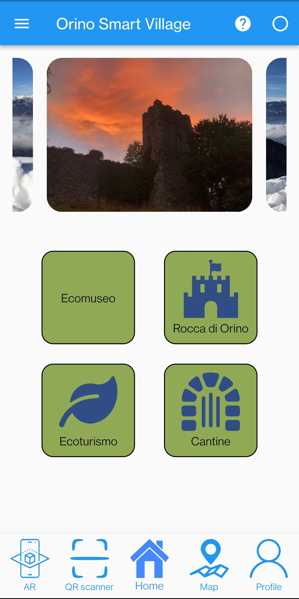

# Orino Smart Village

OrinoAr rebuilt using Flutter (Dart) language.

## Installation

Follow this guide to install Flutter on your computer: [Link](https://docs.flutter.dev/get-started/install)

## Features

- [x] QR code scanner
- [x] English translation
- [ ] Backend integration
- [ ] Augmented Reality (AR)

## Screenshots

