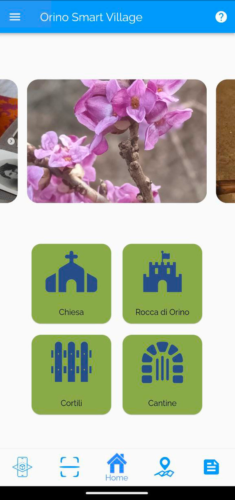

# Orino Smart Village

OrinoAr rebuilt using Flutter (Dart) language.

## Installation

Follow this guide to install Flutter on your computer: [Link](https://docs.flutter.dev/get-started/install)

## Features
- Onboarding screen
- QR code scanner
- Map with locations
- Fetch post using Wordpress API

## Roadmap
- [ ] Implement locations in Augmented Reality (AR)
- [ ] Cache images and posts
- [ ] Filter locations and tracks in the maps screen

## Screenshots

## Author
- [@alex27riva](https://www.github.com/alex27riva)

## Collaborators
- [@Marcalexorlando](https://github.com/Marcalexorlando)
- [@Samuuue](https://github.com/Samuuue)
